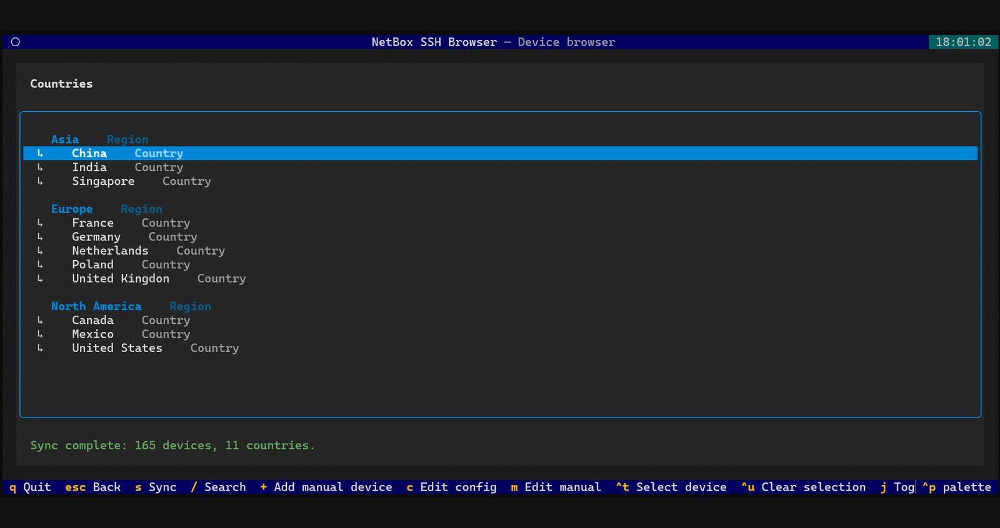

# NetBox SSH Browser

NetBox SSH Browser is a terminal application for browsing NetBox devices and
opening SSH sessions. It groups devices by location and role, with search by
name or IP address. Connections use the system OpenSSH client, directly or
through a configured jump host. On macOS, iTerm2 can open selected devices in
separate tabs.

Inventory is synchronized manually and cached locally for use when NetBox is
unavailable. Hosts missing from NetBox can be added to a separate manual
inventory. The application reads NetBox data without modifying it and does
not store SSH credentials.



## Contents

- [Recent Changes](#recent-changes)
- [What It Does](#what-it-does)
- [Safety Model](#safety-model)
- [Requirements](#requirements)
- [Installation](#installation)
- [Configuration](#configuration)
- [First Run](#first-run)
- [Navigation](#navigation)
- [Manual Inventory](#manual-inventory)
- [Inventory Rules](#inventory-rules)
- [Local Cache](#local-cache)
- [Development](#development)
- [Compatibility](#compatibility)
- [Acknowledgements](#acknowledgements)

## Recent Changes

- Sites without regions and configurable `auto`, `regions`, or `sites` tree layouts.
- Configurable SSH address priority, including OOB IP and optional device name.
- Safer API pagination and SSH target handling, including jump hosts.
- SSH jump host with saved per-device selection (`J`). The target SSH client
  runs on the jump host and supports password prompts without TCP forwarding.
- Device type and name filters using glob patterns, such as `MX*` and `TEST-*`.
- Navigation restores the selected entry when returning from a site or branch.

See [CHANGELOG.md](CHANGELOG.md) for release details.

## What It Does

- Reads regions, sites, and devices from the NetBox REST API.
- Builds a navigable location tree from NetBox region and site relationships.
- Groups countries under parent regions, branches under cities, and devices
  under Device Roles.
- Searches all cached devices by name or primary IP address.
- Selects primary IPv4, primary IPv6, OOB IP, or the device name in a configurable
  order; devices without any enabled address source are omitted.
- Uses the current shell user and the existing OpenSSH configuration.
- Supports a configurable SSH jump host with persistent per-device selection.
- Keeps the last successful inventory available when NetBox is offline.

## Safety Model

- Synchronization is manual and runs only after pressing `S`.
- The application performs read-only `GET` requests to NetBox.
- NetBox remains responsible for authentication and object permissions.
- The API token is read from the private user configuration or, when set, from
  `NETBOX_API_TOKEN`. It is never written to cache or logs.
- The NetBox token and URL are removed from the child SSH process environment.
- SSH is started as an argument list without `shell=True`.
- Host keys, SSH Agent, keys, and connection options remain managed
  by the system OpenSSH client and `~/.ssh/config`.
- A failed or interrupted sync never overwrites the previous valid cache.
- The cache directory is mode `0700` and the cache file is mode `0600`.
- The application does not require `sudo` or write to system directories.

## Requirements

- Python 3.11 or newer.
- A NetBox REST API token with view permissions for DCIM regions, sites, and
  devices.
- The system `ssh` command.
- A terminal with standard TUI support, such as iTerm2, Terminal.app, or a
  Linux terminal emulator.

NetBox API v1 and v2 tokens are supported. Tokens beginning with `nbt_` use
Bearer authentication; legacy tokens use Token authentication.

## Installation

Install with `pipx` to keep dependencies isolated and add `nssh` to `PATH`.

### macOS

```bash
brew install pipx
pipx ensurepath
pipx install netbox-ssh-browser
```

Open a new terminal after `pipx ensurepath`.

### Linux

On Ubuntu 23.04 or newer:

```bash
sudo apt update
sudo apt install pipx
pipx ensurepath
pipx install netbox-ssh-browser
```

On Fedora, replace the first two commands with `sudo dnf install pipx`. Open a
new terminal after updating `PATH`.

### Windows

Install Python 3.13 from WinGet in PowerShell:

```powershell
winget install --exact --id Python.Python.3.13
```

Close all PowerShell windows and reopen PowerShell to refresh `PATH`.
Check Python and install `pipx`:

```powershell
py --version
py -m pip install --user pipx
py -m pipx ensurepath
```

Reopen PowerShell again to pick up the `pipx` paths, then install the package:

```powershell
pipx --version
pipx install netbox-ssh-browser
nssh --version
```

`nssh --version` prints the installed package version. If you use Scoop,
you can install pipx with `scoop install pipx` instead.

### Verify, upgrade, and uninstall

```bash
nssh --version
pipx upgrade netbox-ssh-browser
pipx uninstall netbox-ssh-browser
```

`pipx` normally places the command link in `~/.local/bin` on macOS and Linux,
and `%USERPROFILE%\.local\bin` on Windows. The isolated application code is
stored under the platform-specific `PIPX_HOME`:

- macOS: `~/Library/Application Support/pipx/venvs/netbox-ssh-browser`
- Linux: `~/.local/share/pipx/venvs/netbox-ssh-browser`
- Windows: `%LOCALAPPDATA%\pipx\venvs\netbox-ssh-browser`

Check the paths used by your installation:

```bash
pipx environment --value PIPX_HOME
pipx environment --value PIPX_BIN_DIR
```

### Local development

Create an isolated editable installation:

```bash
python3 -m venv .venv
source .venv/bin/activate
python -m pip install -e .
```

To run the development version without activating the environment, add a symlink:

```bash
ln -s \
  "/absolute/path/to/netbox-ssh-browser/.venv/bin/nssh" \
  "$HOME/bin/nssh"
```

The link remains valid only while the project and `.venv` stay at the same
location.

For release preparation and PyPI publication, see
[PUBLISHING.md](PUBLISHING.md).

## Configuration

Set the NetBox URL and API token in `config.toml`:

```toml
[netbox]
url = "https://netbox.example.com"
api_token = "your-token"
verify_ssl = true
```

Enter the token without a `Bearer` or `Token` prefix; the application adds it.
These environment variables override corresponding TOML settings:

| Variable | Overrides |
|---|---|
| `NETBOX_URL` | `[netbox] url` |
| `NETBOX_API_TOKEN` | `[netbox] api_token` |
| `NETBOX_VERIFY_SSL` | `[netbox] verify_ssl` |
| `NETBOX_SSH_CONFIG` | Selects the configuration file |

For example, in Linux or WSL you can set overrides for the current shell:

```bash
export NETBOX_URL="https://netbox.example.com"
export NETBOX_API_TOKEN="your-token"
export NETBOX_VERIFY_SSL="true"
```

Press `C` in `nssh` to create or edit the configuration. On macOS and Linux,
you can also create it manually:

```bash
mkdir -p ~/.config/netbox-ssh-browser
nano ~/.config/netbox-ssh-browser/config.toml
chmod 600 ~/.config/netbox-ssh-browser/config.toml
```

To use a different file:

```bash
export NETBOX_SSH_CONFIG="/path/to/config.toml"
```

Configuration files are checked in this order:

1. `NETBOX_SSH_CONFIG`.
2. `~/.config/netbox-ssh-browser/config.toml`.
3. `config.toml` in the current working directory.

Environment variables override corresponding TOML values. Keep the user
configuration private with mode `0600` and never commit a real token.

### NetBox settings

TLS certificate verification is enabled by default. For a development instance
with a self-signed certificate, you can disable it:

```toml
[netbox]
verify_ssl = false
```

For production, keep `verify_ssl = true` and use a certificate trusted by the
client.

### Inventory filters

```toml
[sync]
device_statuses = ["active"]
ignored_manufacturers = ["Example Manufacturer"]
ignored_device_types = ["MX*"]
ignored_name_patterns = ["*CORE", "TEST-*"]
device_roles = [
  "Access Switch",
  "Core Router",
  "Edge Router",
]
```

- `device_statuses` contains NetBox status slugs. An empty list downloads all
  statuses.
- `device_roles` contains exact Device Role names, compared
  case-insensitively. An empty list includes every role.
- `ignored_manufacturers` accepts manufacturer names, slugs, or display values,
  compared case-insensitively. An empty list excludes nothing.
- `ignored_device_types` contains case-insensitive glob patterns matched against
  a device type's model, slug, and display value.
- `ignored_name_patterns` contains case-insensitive glob patterns matched against
  device names. `*` matches any text and `?` matches one character.
- Status filters are sent to the NetBox API. Other inventory filters are
  applied before the cache is written.

### Automatic configuration updates

On startup and when reloading configuration with `C`, `nssh` adds missing
`sync.address_order`, `tree.layout`, and `tree.unassigned_group` settings to the
active configuration file selected by the precedence rules above. Existing
values (including empty lists), comments, and custom settings are preserved.

The application runs with your user permissions and never requests `sudo` or
administrator access. Updates are atomic. If the file is read-only or cannot
be replaced, a warning is shown and the application continues using the
existing settings and in-memory defaults.

For newly inserted `address_order` entries in a regular TOML table, the
`# First available source wins...` comment starts on a separate line. Existing
entries are not reformatted. If no configuration file exists, press `C` to
create one from the current template.

### SSH address selection

```toml
[sync]
address_order = ["primary_ip4", "primary_ip6", "oob_ip", "fqdn"]
```

The first non-empty address wins. The default order is shown above. `fqdn` uses
NetBox's device `name` as a DNS/SSH target; it does not read a separate FQDN field
or check DNS resolution. Put `oob_ip` first to prefer out-of-band management.

Only listed sources are used. For example, `["oob_ip", "primary_ip4"]` excludes
IPv6 and name-based connections; `["oob_ip"]` imports only devices with an OOB
address. Devices without any selected address are omitted and counted in the
synchronization summary. An empty list (`[]`) omits all NetBox devices. Unknown
or duplicate source names are rejected.

Press `S` after changing this setting: synchronization stores the selected
address in the offline cache. Manual device targets are unchanged.

### SSH jump host

Press `C` and set the jump host in `config.toml`:

```toml
[ssh]
jump_host = "jump-host"
```

Use a hostname, IP address, `user@host`, or an alias from `~/.ssh/config`.
For example, `admin@bastion.example.com` connects to the bastion as `admin`.

Highlight a NetBox or manual device and press `J` to enable the jump host.
Press `Enter` to connect, or select devices for an iTerm2 multi-tab launch.
Press `J` again to use direct SSH. An empty `jump_host` setting prevents new
selections.

Devices marked `J` use the jump host; others connect directly. Choices are saved
in `jump-host-devices.json` alongside [`manual.json`](#manual-inventory) and
survive restarts and inventory syncs.

The connection runs a second SSH client on the jump host:

```bash
ssh -tt jump-host "ssh target"
```

The jump host needs an SSH client and network access to the target. Target DNS
resolution, SSH settings, host keys, and authentication are handled there.
This works when TCP forwarding is disabled and allows password prompts on the
target connection. The application does not store passwords.

## First Run

1. Set `url` and `api_token` in the private user `config.toml`.
2. Run the application:

   ```bash
   nssh
   ```

3. Press `S` to load inventory from NetBox. The list is empty until the first sync.
4. Check the status bar for errors.
5. Use the arrow keys and `Enter` to browse locations and connect to a device.

The `/api/status/` endpoint is checked first. Inventory is saved only after all
required API requests and filters complete successfully.

## Navigation

| Key | Action |
|-----|--------|
| `Up` / `Down` | Move between selectable entries |
| `Enter` | Open a location or start SSH for a device |
| `Ctrl+T` / `Space` | Select or unselect a device for a multi-session launch |
| `Ctrl+U` | Clear all selected devices |
| `J` | Enable or disable the configured jump host for a device |
| `Esc` | Close search or return to the previous level |
| `/` | Search all cached devices by name or primary IP |
| `S` | Sync from NetBox |
| `+` | Add a manual device to the current branch |
| `C` | Edit the active `config.toml` in the shell editor |
| `M` | Edit `manual.json` in the shell editor |
| `Q` | Quit |

Location and role headings group the entries:

```text
Region Group A
  Country A
  Country B

City A
  branch-a-01
  branch-a-02

Access Switch
  switch-01    192.0.2.10
  switch-02    switch-02.example.com
```

Arrow keys skip headings. Opening a device suspends the browser and starts SSH;
when the session ends, the browser returns to the same view. Going back from a
site or branch restores the previous selection.

In iTerm2 on macOS, select devices with `Ctrl+T` or `Space`, then press `Enter`
to open each connection in a separate tab. The `nssh` tab stays open. macOS may
ask for permission to automate iTerm2 on the first launch. `Ctrl+U` clears the
selection. Other terminals support one SSH session at a time and show a message
if you try to open multiple sessions.

`C` and `M` open files in `$VISUAL`, then `$EDITOR` if set. The fallback is
`nano` on macOS/Linux and `notepad` on Windows. Missing files are created before
opening the editor; changes are reloaded after a successful exit. The editor
process does not inherit the NetBox URL or API token.

## Tree Layout

Existing configurations need no changes: a missing `[tree]` table or `layout`
setting defaults to `auto`.

```toml
[tree]
layout = "auto"  # auto | regions | sites
unassigned_group = "Other sites"
```

- `auto` uses the region view when cached regions or regional manual entries
  exist; otherwise it lists sites directly.
- `regions` preserves region headings and country/city/branch navigation.
  Sites without an available region appear under `Other sites` (configurable).
- `sites` lists all sites directly, even when they belong to regions. Opening a
  site shows devices grouped by Device Role.

These settings only affect the browser, never the NetBox inventory. Editing the
configuration with `C` immediately rebuilds the view from local data, without
an API request. Selections for jump-host connections survive layout changes.

## Manual Inventory

Manual devices are stored in `manual.json`, separately from the NetBox cache.
In the region view, navigate to a location with at least three path elements,
or open a site in the unassigned group. In the sites view, open a site. Press
`+` and enter:

- device name,
- IP address or hostname,
- Device Role.

The current location supplies the location fields. In the sites view, only
`branch` is filled, using the site name. Manual devices are marked `◇` and included in `/` search and SSH connections.

To edit the file directly, use this format:

```json
{
  "version": 1,
  "devices": [
    {
      "region": "Region Group A",
      "country": "Country A",
      "city": "City A",
      "branch": "branch-a-01",
      "role": "Access Switch",
      "name": "manual-switch-01",
      "target": "192.0.2.50"
    }
  ]
}
```

The `region`, `country`, and `city` fields may be omitted, empty strings, or
`null`. `branch`, `role`, `name`, and `target` must contain non-empty text.
Existing complete v1 entries remain supported. For a site-only entry:

```json
{
  "version": 1,
  "devices": [
    {
      "branch": "Test Site 01",
      "role": "Core",
      "name": "manual-switch-01",
      "target": "10.250.1.1"
    }
  ]
}
```

Empty location levels are skipped. In `sites` mode, `branch` determines where
an entry appears; stored region/country/city values are retained. In `regions`
mode, entries without a region appear under the configured unassigned group.
Manual entries are matched to locations by name, so use unambiguous site names
when combining them with NetBox sites.

Missing locations are added to the displayed tree from `manual.json`. Sync does
not modify this file. Invalid JSON or an unsupported format stops startup with
an error.

The file is stored in the user data directory:

- macOS: `~/Library/Application Support/netbox-ssh-browser/manual.json`
- Linux: `~/.local/share/netbox-ssh-browser/manual.json`
- Windows: the `netbox-ssh-browser` data directory under `%LOCALAPPDATA%`

The directory is mode `0700` and the file is mode `0600` where supported.

## Inventory Rules

- NetBox API pagination is followed until every permitted object is downloaded.
  Pagination and HTTP redirects must retain the configured scheme, host, and
  port; requests outside that origin are rejected before sending credentials.
- Device status filters are queried separately and results are deduplicated by
  NetBox object ID.
- Devices without an available site cannot be placed in the tree; the sync
  status reports them as omitted. A missing region does not hide a site.
- Empty regions, countries, cities, branches, and Device Role groups are removed.
- A site is not duplicated when its name matches the final region name.
- IP prefixes are stripped before invoking SSH; for example,
  `192.0.2.10/24` becomes `192.0.2.10`.
- SSH target priority is controlled by `[sync] address_order`; the default
  is `primary_ip4`, `primary_ip6`, `oob_ip`, then `fqdn` (device name).
  Devices without an address from these sources are omitted during sync.
- The cache contains only objects visible to the NetBox user associated with
  the API token.
- Manual devices are merged only in memory and are never written to the NetBox
  cache.

## Local Cache

The cache is stored per user:

- macOS: `~/Library/Caches/netbox-ssh-browser/devices.json`
- Linux: `~/.cache/netbox-ssh-browser/devices.json`
- Windows: the `netbox-ssh-browser` cache directory under `%LOCALAPPDATA%`

The JSON cache contains the sync timestamp, regions, sites, Device Roles, device
names, and the selected SSH addresses (primary IP, OOB IP, or device name).
Only devices with an address from `address_order` are stored. Changing that
order requires a new sync with `S`; changing the tree layout works offline.
The cache never contains the NetBox API token or SSH credentials.

The cache format is version 3. It stores minimal region, site, and device
records with ID-based relationships, independently of the selected layout.
An empty region list and sites with `region_id: null` are supported. The tree
is rebuilt from these records locally, so layouts can be changed offline.

After upgrading from cache v2, press `S` once to synchronize. Old snapshots
cannot recover previously omitted sites/devices or their original relationships.
Invalid or unsupported cache files are ignored and the UI asks for a refresh.
Synchronization does not modify `manual.json` or jump-host selections.

## Development

Source files in `src/netbox_ssh`:

- `cli.py` loads configuration and starts the Textual application.
- `config.py` merges TOML settings and environment variables.
- `config_upgrade.py` uses TOML Kit to add missing defaults while preserving
  existing values and comments, then atomically replaces writable files.
- `netbox.py` handles authentication, pagination, status filtering, and API
  requests.
- `service.py` coordinates synchronization and inventory filtering.
- `model.py` builds and prunes the location tree.
- `inventory.py` normalizes API data, selects SSH addresses according to
  `address_order`, omits devices without a selected address, and resolves layouts.
- `cache.py` validates and atomically writes cache version 3.
- `manual.py` validates, stores, and merges persistent manual devices.
- `jump_state.py` stores persistent per-device jump-host choices.
- `tui.py` implements navigation, search, background sync, and SSH handoff.
- `terminal.py` contains the optional multi-tab iTerm2 integration.

Run local checks before submitting changes:

```bash
python -m unittest discover -s tests -v
python -m compileall -q src tests
```

## Compatibility

See [COMPATIBILITY.md](COMPATIBILITY.md) for the supported Python, operating
system, terminal, and NetBox versions.

Manually tested on:

- macOS on Apple silicon (MacBook Pro M5 Pro) with iTerm2,
- Ubuntu under WSL2 on Windows,
- native Windows with PowerShell, Windows Terminal, and Windows OpenSSH.

CI runs the test suite on macOS, Ubuntu, and Windows with Python 3.11 and 3.13.

## Acknowledgements

Development of NetBox SSH Browser was assisted by OpenAI Codex.
