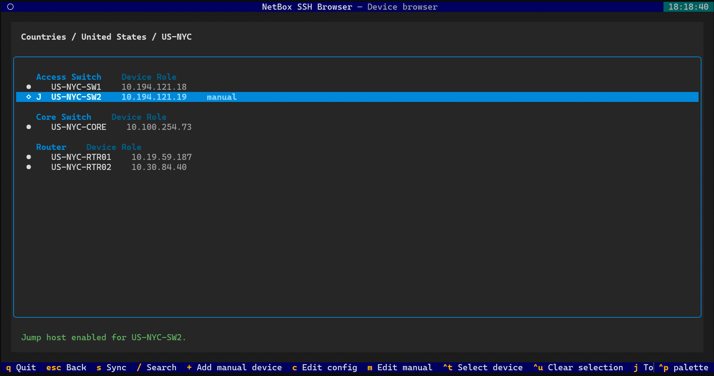
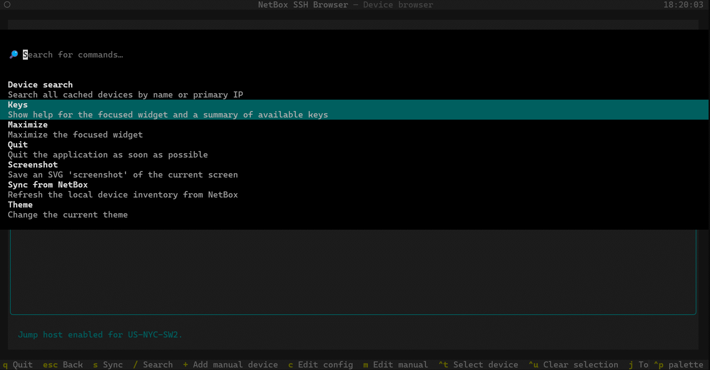
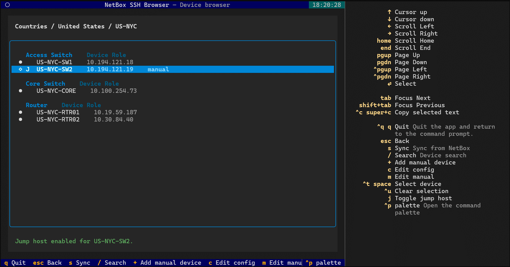

# Screenshots

Screenshots from the NetBox demo instance, ordered by filename.

## Animated demo

The animation combines the 13 screenshots below at 1600 × 846 pixels, with
3 seconds per frame and continuous looping. Images keep their original
proportions and are padded where needed; no content is cropped.

## Countries after synchronization

## Sites in the United States

## Devices at US-CHI

## Device search

## Filtered search results

## Selecting multiple devices

## Adding a manual device

## Manual device details

## Saved manual device

## Manual inventory file

## Enabling the jump host

## Command palette

## Keyboard shortcuts

