# Screenshots

The screenshots below show the NetBox SSH Browser workflow in sequence.

## First launch

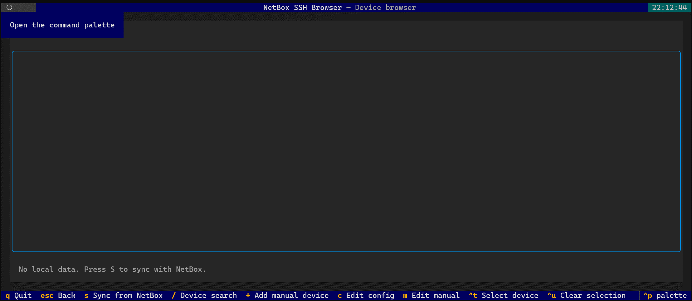

## Saving the configuration

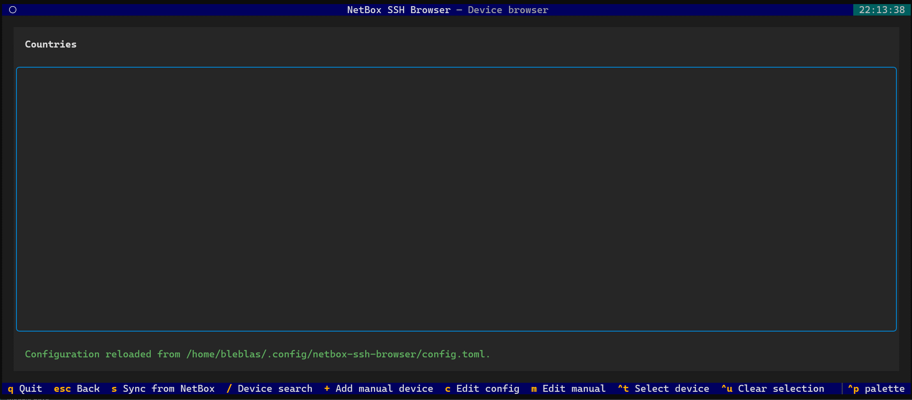

## Sync from NetBox

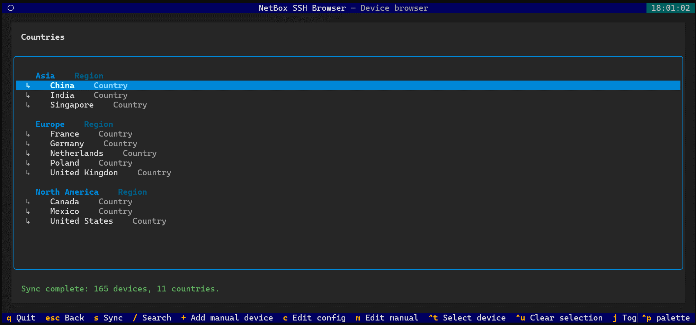

## Adding a manual host

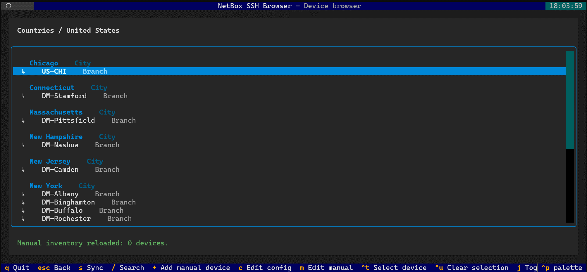

## Browsing the location tree

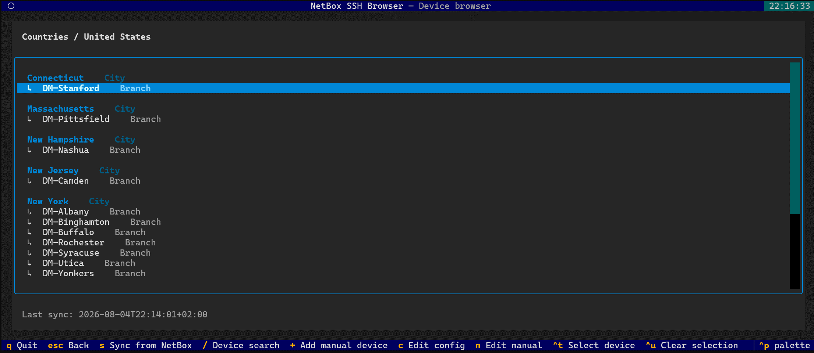

## Device list for a site

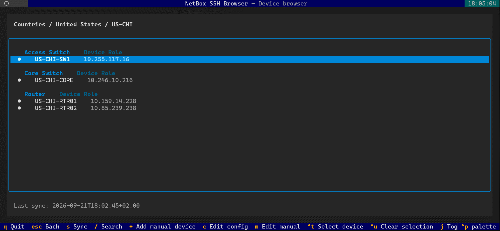

## Searching for a device

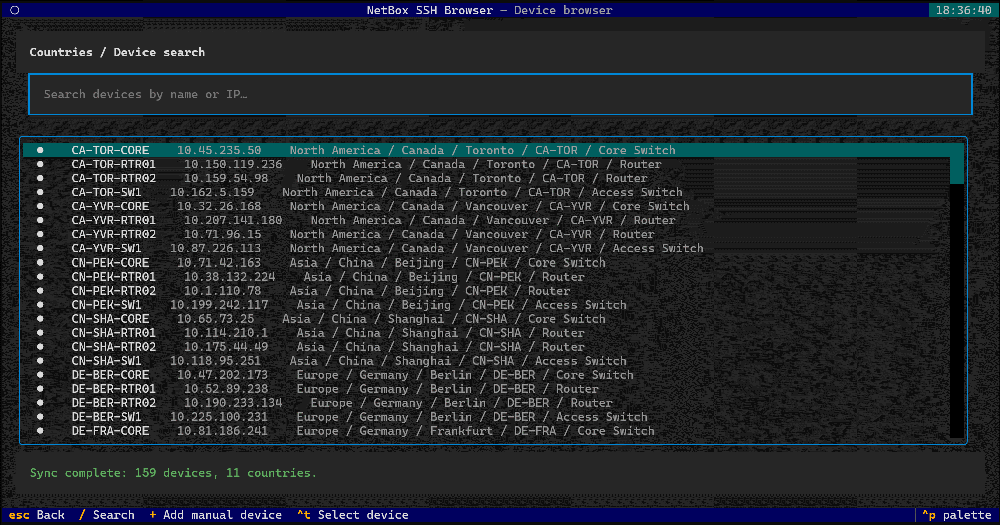

## Viewing search results

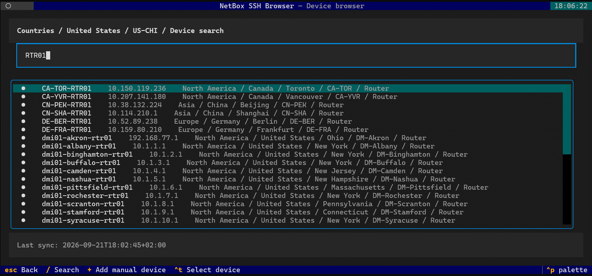

## Selecting devices for multiple SSH sessions

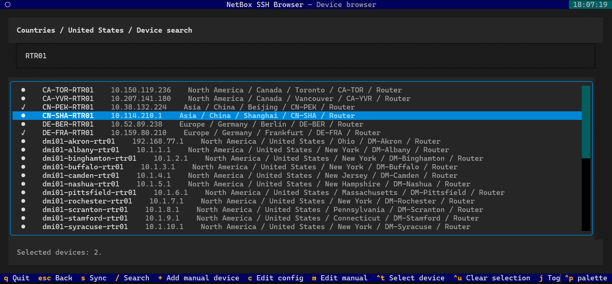

## Adding a manual device

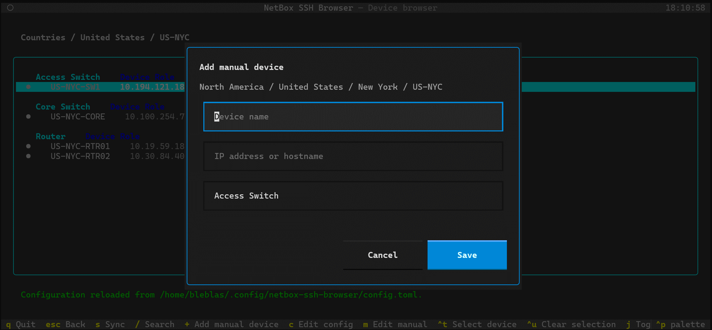

## Entering manual device details

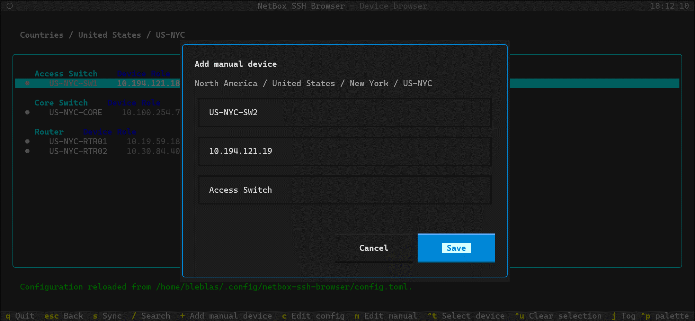

## Manual device added

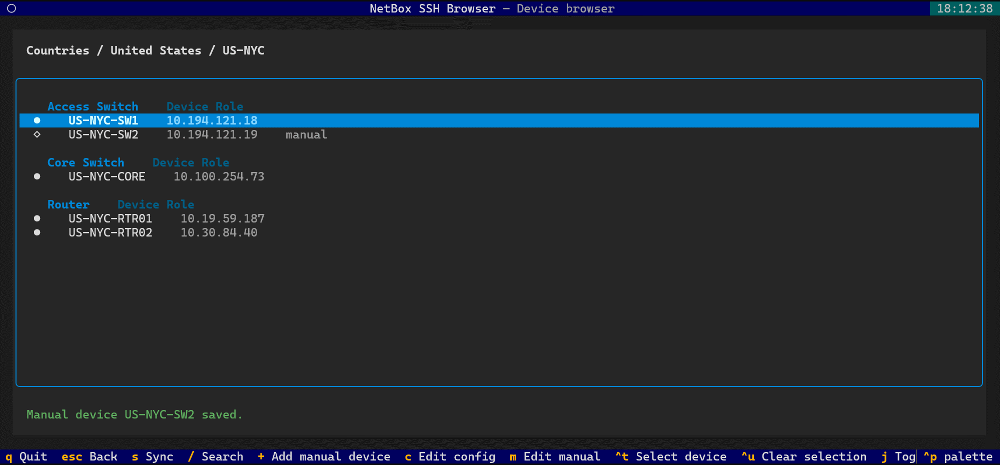

## Previewing the manual inventory file

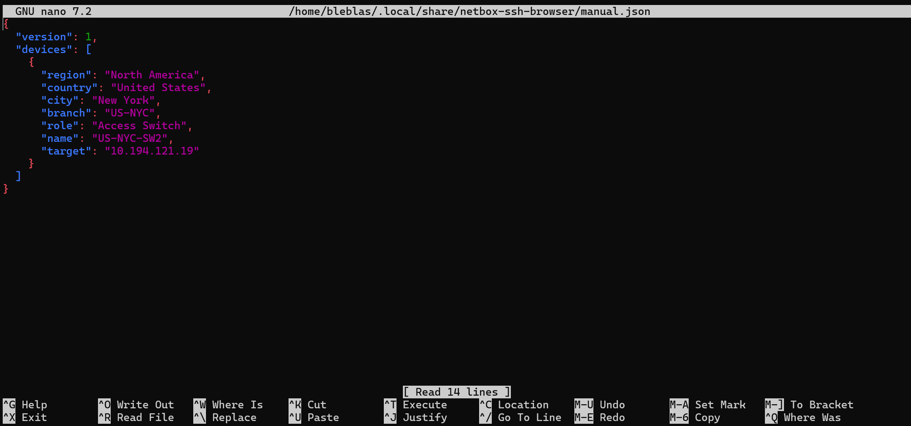
